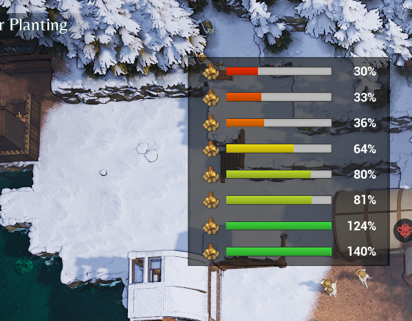

# FireWatch

A campfire quality-of-life mod for [Whiskerwood](https://store.steampowered.com/app/2489330/Whiskerwood/).

FireWatch adds a small panel to the HUD listing your burning campfires, so you can see at a glance which fire is about to go out.

## Features

- **Burn bar per campfire**, coloured from green (full) through yellow (~60%) and red (~30%) to dark red (empty). Values above 100% are possible (the game allows over-filling) and are shown as-is.
- **Lowest first**: the list is sorted so the fire closest to going out is on top, capped to the 10 lowest.
- **Click a row** to glide the camera to that campfire. With the mod option on, the cursor also lands on the fire so you can press **R** to add wood straight away.
- **Stays out of the way**: the panel lives inside the game's own HUD (hides with it on menus, loading screens, photo mode), hides when no campfire is burning, and hides on the naval map.
- **Updates while paused**, twice a second.

Only campfire-type fires (the ones you refuel by hand) are listed; fuelled heaters and boilers are ignored.

## Mod option

Settings → Mods → **FireWatch - Move cursor to clicked fire** (`On` / `Off`, default `On`). With `Off`, clicking a row only moves the camera.

## Installing

- **Steam Workshop:** [subscribe here](https://steamcommunity.com/sharedfiles/filedetails/?id=3807454089).
- **Manually:** put `FireWatch.pak` and `FireWatch.uplugin` in
  `%localappdata%\Whiskerwood\Saved\mods\FireWatch\` (create the folder; file names must stay `FireWatch.*`).

## Repository layout

| Path | What |
|---|---|
| `Mod/FireWatch/` | The mod's source assets (`.uasset`) and `FireWatch.uplugin`. This is the whole mod. |
| `docs/graphs/` | Blueprint graphs as copy-paste text (T3D), for reading or re-pasting into the editor. Reference only: the `.uasset` files are the source of truth and may contain small hand edits. |
| `docs/screenshot.png` | Screenshot, also used as the Workshop preview image. |
| `workshop/` | SteamCMD item file (`FireWatch.vdf`) and [upload steps](workshop/HOW_TO_UPLOAD.md). |
| `sync-from-modkit.sh` | Copies the mod's assets from the modkit into this repo; `--release` also stages the built `.pak` for upload. |

## Building from source

1. Set up the official [Whiskerwood modkit](https://github.com/Whiskerwood-Modding/Whiskerwood-Project) (custom UE 5.6 build, see its README).
2. Copy `Mod/FireWatch/` from this repo to `Content/Mods/FireWatch/` in the modkit project.
3. Open the project, right-click the `FireWatch` folder → **Cook & Install** (Mod Tools). This builds the `.pak` and installs it into the game's mods folder.
4. After editing in the editor, run `./sync-from-modkit.sh` (Git Bash) to copy the changed assets back into `Mod/FireWatch/`, then commit.
   The script assumes the modkit is at `E:\modding\Whiskerwood-Project`; override with `MODKIT=/e/other/path ./sync-from-modkit.sh`.

## How it works

| Asset | Role |
|---|---|
| `BP_Startup` | Runs once at the main menu; registers the mod option via `ModAPI.RegisterModOptions`. |
| `BP_MapLoad` | Runs when a save loads; after `ModAPI.onLoadingFinished` it creates `WBP_FireWatch` and attaches it into the game HUD (`BP_PlayHud` → parent panel of its toolbar, `HideableElements`), falling back to the viewport. |
| `WBP_FireWatch` | The panel. Tick (real time, every 0.5 s) collects all `GridActor`s whose `FueledHeater` component is `BURNING` with fuel source `TEMPORARY`, computes `m_burnTimeRemaining / m_fuelBurnTime`, sorts lowest first and fills a pool of reused rows. Also shows/hides the panel based on fire count and camera zoom (`Pawn_Play.m_desiredZoomDist` > 36000 = naval map). |
| `WBP_FireRow` | One row: icon, progress bar, percentage. `SetData` updates it; clicking sets the camera target `Pawn_Play.m_desiredPanPos` to the fire and optionally centres the mouse cursor. |
| `PAL_FireWatch` | Primary Asset Label that puts the mod into its own pak chunk. |

Adding wood itself is not something mods can trigger. The game's "Add wood" is internal C++, which is why FireWatch takes you to the fire instead.

## Known limitations

- From very high zoom the game's own "Add wood (R)" hover doesn't appear; zoom in a bit after clicking.
- The zoom threshold for the naval map (36000) was measured by hand and may need adjusting if the game's camera changes.

## Credits

Created using the Whiskerwood modkit: https://github.com/Whiskerwood-Modding/Whiskerwood-Project
